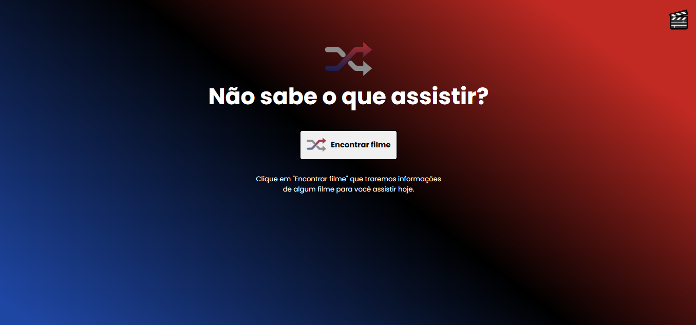
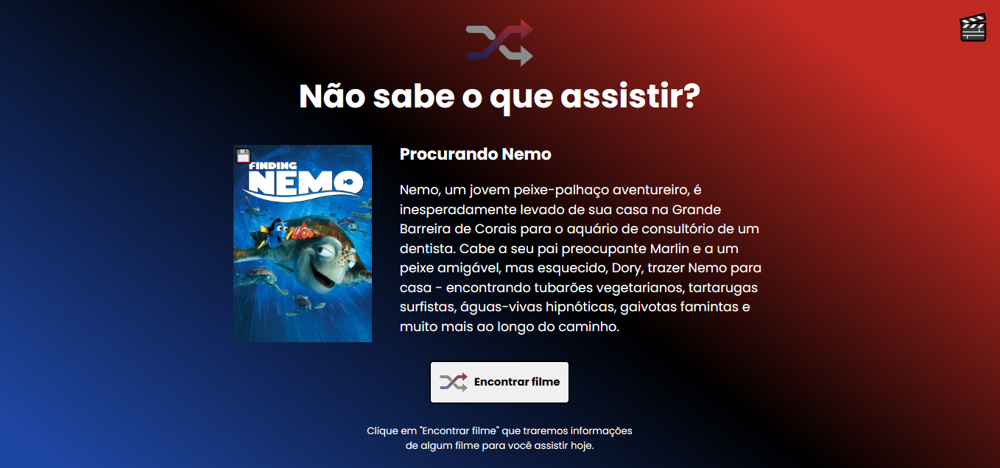
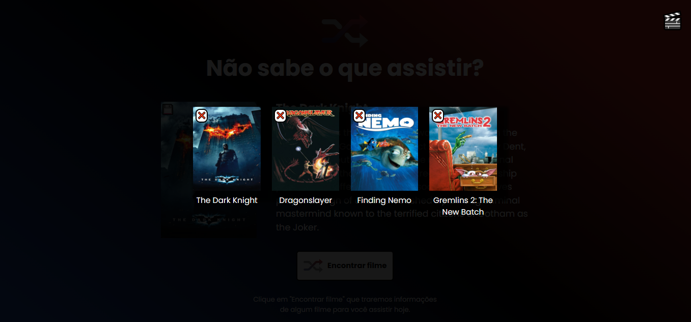

# 💻 Rocketflix
### 🚀 Projeto utilizando a API da <strong>TheMovieDB.</strong>

#### Consiste em um app que ao clicar no botão, sugere um filme aleatório, contendo seu nome, capa e descrição, para você assistir.
 
O Layout do Figma está disponível na plataforma da Rocketseat.

## 📚 Nele apliquei conhecimentos como:
- Programação orientada a objetos
- Single Page Application
- API com método Fetch
- Node Package Manager
- HTML CSS e Javascript
- Responsividade

 

> Layout da versão Destkop

